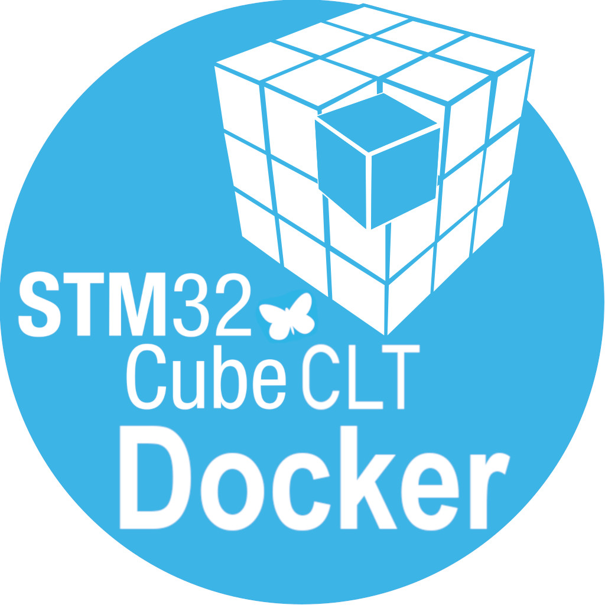

# docker-stm32-cmake

<!-- markdownlint-disable MD033 -->
<table>
  <tr>
    <td></td>
    <td valign="top">
      <b>STM32CubeCLT Version Build Status</b>
      <table>
        <tr><th>Version</th><th>Status</th></tr>
<!-- VERSION_TABLE_START -->
<!-- VERSION_TABLE_END -->
        <tr><td colspan="2" align="center"><a href="docs/versions.md"><b>📋 See all versions →</b></a></td></tr>
      </table>
    </td>
  </tr>
</table>
<!-- markdownlint-enable MD033 -->

A Docker image providing a headless CI/CD environment for [STM32CubeCLT](https://www.st.com/en/development-tools/stm32cubeclt.html) (STMicroelectronics Command Line Tools). Each image ships with STM32CubeCLT pre-installed — ready to use immediately with **no runtime installation required**.

> **Note:** STM32CubeCLT is fully installed during the Docker build process. The container starts instantly with all tools ready to use.

## Usage

Once the container is running, use CLI commands to build and program your STM32 projects.

**Build with CMake:**

    docker run -it -v $(pwd):/workspace uoohyo/stm32-cmake:latest bash -c "
      cd /workspace/your-project
      mkdir -p build && cd build
      cmake .. -G Ninja
      ninja
    "

**Compile with Make:**

    docker run -it -v $(pwd):/workspace uoohyo/stm32-cmake:latest bash -c "
      cd /workspace/your-project
      make
    "

**Generate code with STM32CubeMX:**

    docker run -it -v $(pwd):/workspace uoohyo/stm32-cmake:latest bash -c "
      cd /workspace
      STM32CubeMX -q your-project.ioc
    "

**Program STM32 device:**

    docker run -it --privileged -v /dev/bus/usb:/dev/bus/usb \
      -v $(pwd):/workspace uoohyo/stm32-cmake:latest bash -c "
      STM32_Programmer_CLI -c port=SWD -w firmware.hex -v -rst
    "

## Quick Start

Pull a version-specific image from Docker Hub:

    docker pull uoohyo/stm32-cmake:1.16.0

Or use the latest:

    docker pull uoohyo/stm32-cmake:latest

Run the container:

    docker run -it -v $(pwd):/workspace uoohyo/stm32-cmake:1.16.0

See [docs/versions.md](docs/versions.md) for all available versions.

## Building Locally

To build this image yourself, you need an ST account (free registration at [my.st.com](https://my.st.com)):

    docker build \
      --build-arg ST_USERNAME="your-email@example.com" \
      --build-arg ST_PASSWORD="your-password" \
      --build-arg CUBECLT_VERSION="1.16.0" \
      -t stm32-cmake:local .

## Included Tools

| Component               | Description                                    |
| ----------------------- | ---------------------------------------------- |
| **STM32CubeMX**         | STM32 initialization code generator            |
| **STM32CubeProgrammer** | STM32 programming and debugging tool           |
| **GNU ARM Toolchain**   | arm-none-eabi-gcc for ARM Cortex-M compilation |
| **CMake**               | Build system generator                         |
| **Ninja**               | Fast build system                              |
| **Git**                 | Version control                                |

## CI/CD Integration

**GitHub Actions:**

    name: Build STM32 Firmware
    on: [push]
    jobs:
      build:
        runs-on: ubuntu-latest
        container:
          image: uoohyo/stm32-cmake:latest
        steps:
          - uses: actions/checkout@v4
          - name: Build
            run: |
              mkdir -p build && cd build
              cmake .. -G Ninja && ninja

**GitLab CI:**

    build:
      image: uoohyo/stm32-cmake:latest
      script:
        - mkdir -p build && cd build
        - cmake .. -G Ninja && ninja

## License

[MIT License](./LICENSE)

Copyright (c) 2024-2026 [uoohyo](https://github.com/uoohyo)

Permission is hereby granted, free of charge, to any person obtaining a copy of this software and associated documentation files (the "Software"), to deal in the Software without restriction, including without limitation the rights to use, copy, modify, merge, publish, distribute, sublicense, and/or sell copies of the Software, and to permit persons to whom the Software is furnished to do so, subject to the following conditions:

The above copyright notice and this permission notice shall be included in all copies or substantial portions of the Software.

THE SOFTWARE IS PROVIDED "AS IS", WITHOUT WARRANTY OF ANY KIND, EXPRESS OR IMPLIED, INCLUDING BUT NOT LIMITED TO THE WARRANTIES OF MERCHANTABILITY, FITNESS FOR A PARTICULAR PURPOSE AND NONINFRINGEMENT. IN NO EVENT SHALL THE AUTHORS OR COPYRIGHT HOLDERS BE LIABLE FOR ANY CLAIM, DAMAGES OR OTHER LIABILITY, WHETHER IN AN ACTION OF CONTRACT, TORT OR OTHERWISE, ARISING FROM, OUT OF OR IN CONNECTION WITH THE SOFTWARE OR THE USE OR OTHER DEALINGS IN THE SOFTWARE.
